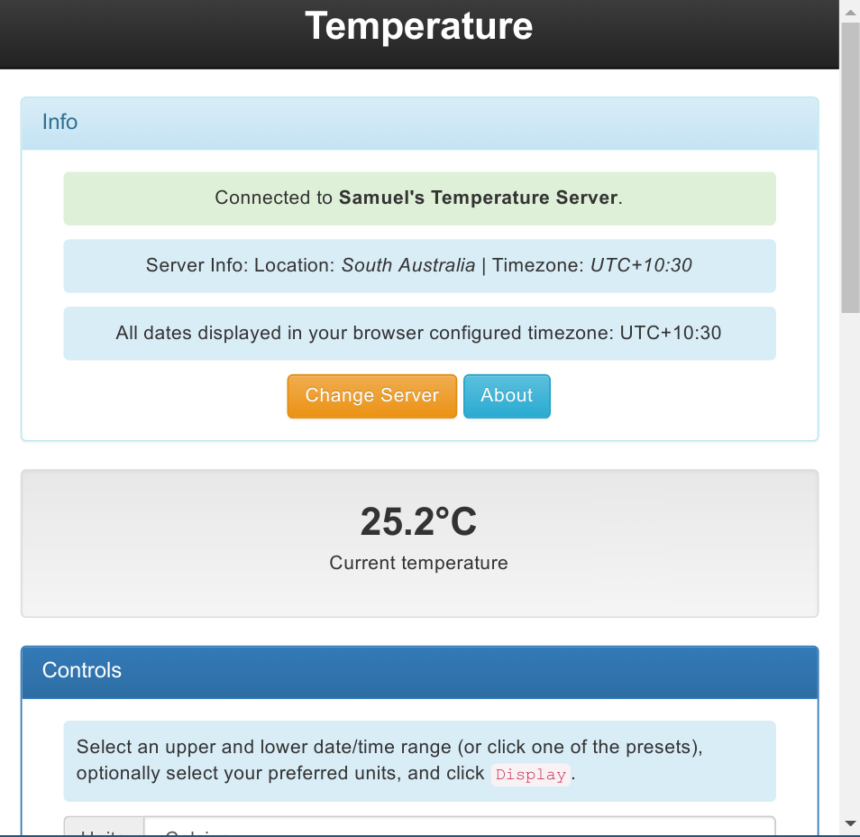
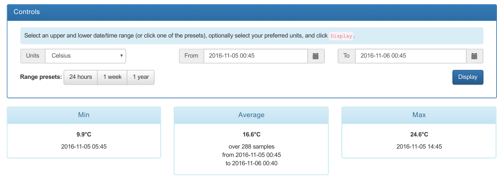
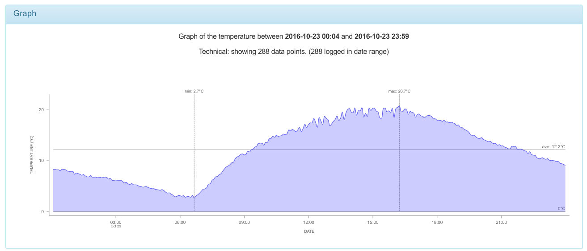
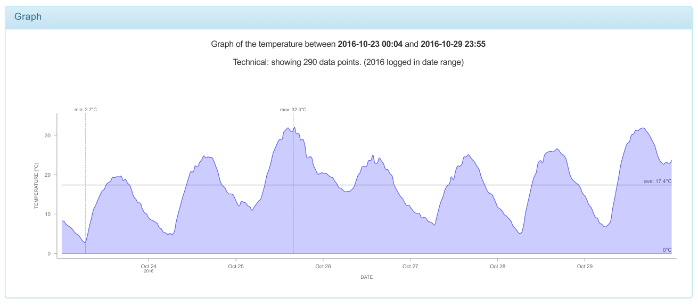
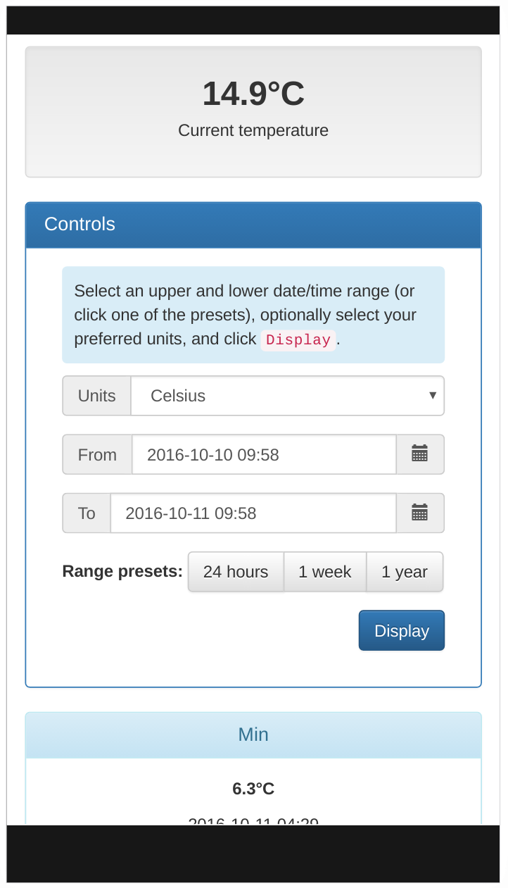
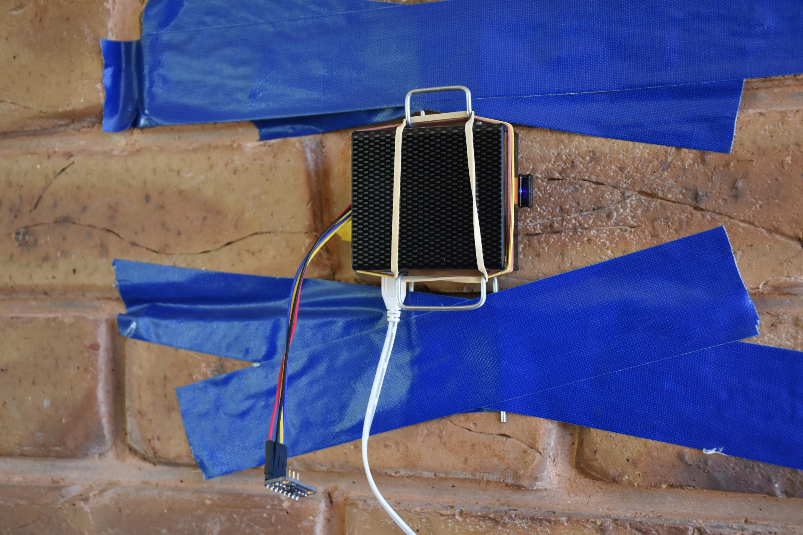

# rpi-temperature-server

[](https://travis-ci.org/swalladge/rpi-temperature-server)

The project for PRT452, 2016.

A server and web app for displaying/logging the temperature and various stats about it from a Raspberry Pi with a
MCP9808 temperature sensor.

Copyright © 2016 Samuel Walladge, Phil Davis


## Screenshots/Photos


General screenshot of webapp.



A view of the controls.



The graph showing the temperature over a day.



The graph showing the temperature over a whole week.



Screenshot of the webapp on a small mobile device.



Photo of a Raspberry Pi monitoring the temperature. (note the temperature sensor wired to it)




## About

The code and instructions here are for the Adafruit MCP9808 Temperature Sensor.
Hardware information can be found at [Adafruit Temperature Sensor Guide](https://cdn-learn.adafruit.com/downloads/pdf/adafruit-mcp9808-precision-i2c-temperature-sensor-guide.pdf)
This is known to work on both ArchLinux and Raspbian.


## Hardware

The temperature sensor can be bought in Australia through (for example) [Little Bird Electronics](https://littlebirdelectronics.com.au).

The useful parts are:

- [MCP9808 Temperature Sensor](https://littlebirdelectronics.com.au/products/mcp9808-high-accuracy-i2c-temperature-sensor-breakout-board) which comes on a small board and with a header strip.
- [Breadboard](https://littlebirdelectronics.com.au/products/breadboard-mini-modular-green), any will do.
- [Jumper wires M-F](https://littlebirdelectronics.com.au/products/jumper-wires-premium-6-m-f-pack-of-10) - male end goes into the breadboard, female onto the RPi GPIO pins.
- while you are ordering, it is always handy to have [M-M](https://littlebirdelectronics.com.au/products/jumper-wires-premium-6-m-m-pack-of-10) and [F-F](https://littlebirdelectronics.com.au/products/jumper-wires-premium-6-f-f-pack-of-10) jumper wires also, just in case.

You can do without the breadboard, if you like, and connect with F-F jumper wires direct from the GPIO pins to the header pins on the MCP9808.
Or use a [GPIO ribbon cable](https://littlebirdelectronics.com.au/products/raspberry-pi-gpio-ribbon-cable-40-pin-6-rpi2-b) to get out of the RPi and go from there to the breadboard using M-M or direct to MCP9808 header using M-F.
Pick an option, depending on your RPi case and how neat you want it to look.


## Installation instructions (with test code to verify)

1. The hardware comes with a separate header strip.
   [Solder](https://learn.adafruit.com/adafruit-mcp9808-precision-i2c-temperature-sensor-guide/wiring)
   the header strip to the MCP9808 board.
   Connect the MCP9808 sensor to the I2C bus (as described in the [Adafruit
   tutorial](https://learn.adafruit.com/mcp9808-temperature-sensor-python-library/hardware)).
   Connect Pi Gnd to MCP9808 Gnd, Pi 3.3V to MCP9808 Vdd, Pi SCL to MCP9808 SCL, Pi SCA to MCP9808 SCA.
   The schematic in the tutorial is of an RPi2 Model B. The pinouts are the same on an RPi3.

2. Ensure that I2C is enabled on the RPi - some useful resources include an [Adafruit
   tutorial](https://learn.adafruit.com/adafruits-raspberry-pi-lesson-4-gpio-setup/configuring-i2c), or the
   [Archwiki](https://wiki.archlinux.org/index.php/Raspberry_Pi#I2C).

    On Raspbian, the basics are:

    ```
    sudo raspi-config
    ```

    - Choose Advanced Options
    - Choose I2C
    - Say yes to enable
    - Reboot

3. Python 3 is required to install and run the software. You will also need `pip` and the `venv` module for setting up
   virtual environments. Note: you may run into trouble with the setup script when using python < 3.4, due to pip not
   being installed in the virtual environment by default. Therefore this project only officially supports python 3.4 or
   a later version.

    ```
    # Note: On Raspbian (and possible other distros), python2 may be the default
    # To check, run:
    python --version
    # if the output shows something like:
    # Python 2.7.12
    # then you may need to install python 3 to run the setup script.
    # Raspbian also requires installing the `python3-venv` package.
    sudo apt-get install python3-venv
    ```

4. Give access to the I2C bus (and thus the temperature sensor) to a group and create an ordinary user:

    ```
    # Create a group
    sudo addgroup sensor
    # Create a user in the group
    sudo adduser --ingroup sensor testuser
    # Give the group read-write access to the I2C device
    sudo setfacl -m group:sensor:rw /dev/i2c-1
    ```

5. Login as 'testuser' and run the following commands on the RPi:

    ```
    # clone the repo
    git clone https://github.com/swalladge/rpi-temperature-server.git
    cd rpi-temperature-server

    # run the server setup script
    ./server_setup.sh

    # activate the virtualenv
    # note: once in the venv, python and pip will be the correct version, regardless of the system default
    source env/bin/activate

    # now you're good to go!
    # run the following to test the sensors
    python simpletest.py
    ```

    It is recommended that you run the application software as an ordinary (unpriv) user, like in these instructions. This avoids you accidentally modifying (or breaking) your operating system installation while playing with the application.


## Using the actual server

See [docs/SERVER_README.md](docs/SERVER_README.md) for more information.


## License

    This program is free software: you can redistribute it and/or modify
    it under the terms of the GNU General Public License as published by
    the Free Software Foundation, either version 3 of the License, or
    (at your option) any later version.

    This program is distributed in the hope that it will be useful,
    but WITHOUT ANY WARRANTY; without even the implied warranty of
    MERCHANTABILITY or FITNESS FOR A PARTICULAR PURPOSE.  See the
    GNU General Public License for more details.

